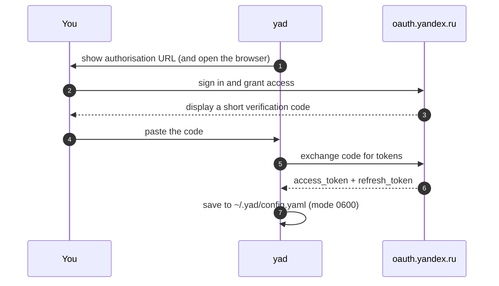

<div align="center">

# 📁 YaD — Yandex.Disk in your terminal

**A fast, keyboard-driven TUI for [Yandex.Disk](https://disk.yandex.ru).**
Browse, upload, download, publish and restore files without ever leaving the shell.

[](https://github.com/ilyabrin/yad/actions/workflows/ci.yml)
[](https://github.com/ilyabrin/yad/releases/latest)
[](https://pkg.go.dev/github.com/ilyabrin/yad)
[](https://go.dev)
[](#-licence)

[Quick start](#-quick-start) · [Keybindings](#%EF%B8%8F-keybindings) · [Configuration](#%EF%B8%8F-configuration) · [Authentication](#-authentication) · [Contributing](#-contributing) · [Русская версия](README.ru.md)

</div>

---

## ✨ What you get

|                    | |
| ------------------ | ---------------------------------------------------------------------------- |
| 🗂 **Browse**       | Full-screen file browser with pagination, live `/` filter and 6 sort modes    |
| ⬆️ **Upload**       | Local files *or* remote URLs, with a real-time progress bar                   |
| ⬇️ **Download**     | Single file or everything you selected, queued automatically                  |
| ✂️ **Manage**       | Create directories, rename, delete — individually or in bulk                  |
| 🔗 **Publish**      | One key to publish, copy the public link, or open it in your browser          |
| 🗑 **Trash**        | Restore items, delete them for good, or empty the bin                         |
| 📊 **Disk info**    | Storage breakdown with a visual usage bar                                     |
| 🔐 **OAuth 2.0**    | Guided first-run setup, tokens stored at `0600`, silent background refresh    |
| 💾 **Remembers you**| Default sort order and last visited directory restored on the next launch     |

<div align="center">

*Published files are tinted green and marked with `⇡`.*

</div>

---

## 🚀 Quick start

```sh
go install github.com/ilyabrin/yad@latest
yad
```

That's it — `yad` walks you through authentication on first launch and stores the result in `~/.yad/config.yaml`.

```console
$ yad              # open the file browser
$ yad --help       # print keybindings and config paths
$ yad --version    # print version
```

> [!TIP]
> Already have a token? Skip the wizard entirely:
> ```sh
> YANDEX_DISK_TOKEN=y0_AgAA... yad
> ```

---

## 📦 Installation

<details open>
<summary><b>go install</b> — quickest</summary>

```sh
go install github.com/ilyabrin/yad@latest
```

> [!NOTE]
> Binaries built this way have **no embedded OAuth client secret**, so the wizard asks you to paste a token manually instead of running the automatic code exchange. See [Authentication](#-authentication).

</details>

<details>
<summary><b>Pre-built binaries</b> — recommended</summary>

Grab the archive for your platform from the [latest release](https://github.com/ilyabrin/yad/releases/latest) and put `yad` on your `PATH`:

```sh
tar -xzf yad-<version>-<os>-<arch>.tar.gz
sudo mv yad /usr/local/bin/
yad --version
```

Checksums are published as `checksums.txt` alongside the archives.

</details>

<details>
<summary><b>From source</b></summary>

```sh
git clone https://github.com/ilyabrin/yad
cd yad
go build -o yad .
```

To produce a build with the full OAuth flow enabled, inject your client secret at link time:

```sh
go build \
  -ldflags "-X github.com/ilyabrin/yad/internal/auth.clientSecret=YOUR_SECRET" \
  -o yad .
```

</details>

**Requirements:** Go 1.25+ (only to build) · Linux, macOS or Windows · any 256-colour terminal.

---

## ⌨️ Keybindings

### File browser

<table>
<tr><th colspan="2">Navigate</th><th colspan="2">Act</th></tr>
<tr>
<td><kbd>↑</kbd> <kbd>k</kbd></td><td>move up</td>
<td><kbd>u</kbd></td><td>upload a local file</td>
</tr>
<tr>
<td><kbd>↓</kbd> <kbd>j</kbd></td><td>move down</td>
<td><kbd>U</kbd></td><td>upload from a URL</td>
</tr>
<tr>
<td><kbd>↵</kbd> <kbd>→</kbd> <kbd>l</kbd></td><td>open directory</td>
<td><kbd>d</kbd></td><td>download (bulk if selected)</td>
</tr>
<tr>
<td><kbd>←</kbd> <kbd>h</kbd> <kbd>⌫</kbd></td><td>go to parent</td>
<td><kbd>n</kbd></td><td>new directory</td>
</tr>
<tr>
<td><kbd>/</kbd></td><td>filter by name (live)</td>
<td><kbd>r</kbd></td><td>rename</td>
</tr>
<tr>
<td><kbd>s</kbd></td><td>cycle sort order</td>
<td><kbd>D</kbd></td><td>delete (bulk if selected)</td>
</tr>
<tr>
<td><kbd>Space</kbd></td><td>toggle selection</td>
<td><kbd>p</kbd></td><td>publish / show public link</td>
</tr>
<tr>
<td><kbd>Ctrl</kbd>+<kbd>A</kbd></td><td>select / deselect all visible</td>
<td><kbd>c</kbd></td><td>copy public URL</td>
</tr>
<tr>
<td><kbd>Esc</kbd></td><td>clear filter, then selection</td>
<td><kbd>o</kbd></td><td>open public URL in browser</td>
</tr>
<tr>
<td><kbd>R</kbd> <kbd>Ctrl</kbd>+<kbd>R</kbd></td><td>refresh listing</td>
<td><kbd>m</kbd></td><td>file metadata</td>
</tr>
<tr>
<td><kbd>t</kbd></td><td>open trash</td>
<td><kbd>i</kbd></td><td>disk usage info</td>
</tr>
<tr>
<td><kbd>q</kbd> <kbd>Ctrl</kbd>+<kbd>C</kbd></td><td>quit</td>
<td colspan="2"></td>
</tr>
</table>

> [!NOTE]
> <kbd>/</kbd> filters the **current page** (100 items). Pagination is server-side, so clear the filter with <kbd>Esc</kbd> before paging with <kbd>↑</kbd>/<kbd>↓</kbd>.

### Trash · <kbd>t</kbd>

| Key                                   | Action                    |
| ------------------------------------- | ------------------------- |
| <kbd>↑</kbd> <kbd>k</kbd> / <kbd>↓</kbd> <kbd>j</kbd> | move                      |
| <kbd>r</kbd>                          | restore item              |
| <kbd>D</kbd>                          | delete permanently        |
| <kbd>E</kbd>                          | empty trash               |
| <kbd>R</kbd> <kbd>Ctrl</kbd>+<kbd>R</kbd> | refresh               |
| <kbd>q</kbd> <kbd>←</kbd> <kbd>Esc</kbd> | back to browser        |

### Disk info · <kbd>i</kbd>

| Key                                      | Action          |
| ---------------------------------------- | --------------- |
| <kbd>q</kbd> <kbd>←</kbd> <kbd>Esc</kbd> | back to browser |

---

## 🔐 Authentication

On first launch `yad` runs a short wizard:



After that, tokens load automatically. When the access token expires, `yad` refreshes it silently in the background — you never see the wizard again.

### Token sources, in priority order

| # | Source                         | When to use                              |
| - | ------------------------------ | ---------------------------------------- |
| 1 | `YANDEX_DISK_TOKEN` env var    | CI, scripting, throwaway sessions        |
| 2 | `access_token` in the config   | normal interactive use (set by the wizard) |

> [!IMPORTANT]
> Setting `YANDEX_DISK_TOKEN` disables automatic refresh — the env var is treated as an explicit override that `yad` must not replace.

<details>
<summary><b>Using your own Yandex application</b></summary>

Register an app at [oauth.yandex.ru](https://oauth.yandex.ru) with the `cloud_api:disk.read` and `cloud_api:disk.write` scopes, then add the credentials to `~/.yad/config.yaml`:

```yaml
oauth:
  client_id: "your_client_id"
  client_secret: "your_client_secret"
```

These override the build-time defaults entirely.

</details>

---

## ⚙️ Configuration

Stored at `~/.yad/config.yaml`, created automatically with mode `0600`.

```yaml
# ── Written by the OAuth wizard — you normally never touch these ──
access_token: "y0_AgAA..."
refresh_token: "1:abc..."
token_expiry: "2026-06-01T12:00:00Z"

# ── Optional: bring your own registered Yandex application ──
oauth:
  client_id: "your_client_id"
  client_secret: "your_client_secret"

# ── Optional: UI preferences ──
default_sort: "-modified"
last_path: "disk:/photos"
```

| Key             | Type   | Default  | Description                                                                     |
| --------------- | ------ | -------- | ------------------------------------------------------------------------------- |
| `default_sort`  | string | `name`   | One of `name`, `-name`, `modified`, `-modified`, `size`, `-size` (`-` = descending) |
| `last_path`     | string | `/`      | Directory reopened on launch; updated on exit. Set to `""` to always start at root |
| `oauth.*`       | string | —        | Overrides the built-in OAuth application                                        |

| Environment variable | Effect                                                     |
| -------------------- | ---------------------------------------------------------- |
| `YANDEX_DISK_TOKEN`  | Overrides the stored access token and disables auto-refresh |

---

## 🔒 Security

- Config is written with mode `0600` and the parent directory with `0700` — readable only by you.
- The OAuth **client ID is public by design**; the **client secret** is injected at release build time via `-ldflags` and never appears in this repository. This is the same approach used by `gh` and `heroku`.
- The secret protects the token-exchange endpoint. It does **not** grant access to anyone's data.
- Prefer full control? Register your own application and set `oauth.client_id` / `oauth.client_secret`.

> [!WARNING]
> `~/.yad/config.yaml` contains live credentials. Don't commit it, sync it, or include it in shell dotfile repos.

---

## 🧑‍💻 Contributing

```sh
git clone https://github.com/ilyabrin/yad && cd yad
go test ./...                 # unit tests
go test -race -cover ./...    # what CI runs
gofmt -l . && go vet ./...    # what CI checks
go run .                      # try it locally
```

<details>
<summary><b>Project layout</b></summary>

```
.
├── yad.go              # entrypoint: flags, client resolution, session persistence
├── config.go           # ~/.yad/config.yaml load/save + precedence rules
├── internal/auth/      # Yandex OAuth 2.0 (authorise, exchange, refresh)
└── tui/
    ├── app.go          # root Bubbletea model, screen routing, token refresh
    ├── setup.go        # first-run OAuth wizard screen
    ├── browser_*.go    # file browser — model / update / view
    ├── trash.go        # trash screen
    ├── diskinfo.go     # disk usage screen
    ├── ops.go          # async API commands (upload, download, publish…)
    ├── dialog.go       # confirm / input / progress overlays
    ├── text.go         # width-aware, ANSI-safe text truncation
    ├── keys.go         # keybinding map
    └── styles.go       # lipgloss palette
```

The browser follows the Elm architecture: **model** holds state, **update** turns messages into new state plus commands, **view** is a pure function of the model. API calls always happen inside a `tea.Cmd`, never in `Update`.

</details>

Commits follow [Conventional Commits](https://www.conventionalcommits.org/) (`feat:`, `fix:`, `docs:`, `ci:`…) — the release changelog is generated from them.

See [CONTRIBUTING.md](CONTRIBUTING.md) for the full guide, and [SECURITY.md](SECURITY.md) before reporting anything security-related.

---

## 🧩 Built with

| Library | Role |
| ------- | ---- |
| [charmbracelet/bubbletea](https://github.com/charmbracelet/bubbletea) | TUI framework (Elm architecture) |
| [charmbracelet/bubbles](https://github.com/charmbracelet/bubbles)     | spinner, text input, key bindings |
| [charmbracelet/lipgloss](https://github.com/charmbracelet/lipgloss)   | terminal styling and layout |
| [ilyabrin/disk](https://github.com/ilyabrin/disk)                     | Yandex.Disk REST API client |
| [atotto/clipboard](https://github.com/atotto/clipboard)               | cross-platform clipboard access |

---

## 📄 Licence

Dual-licensed, at your option, under either of:

- **MIT** — [LICENSE-MIT](LICENSE-MIT) · [spdx.org](https://spdx.org/licenses/MIT.html)
- **Apache License 2.0** — [LICENSE-APACHE](LICENSE-APACHE) · [spdx.org](https://spdx.org/licenses/Apache-2.0.html)

`SPDX-License-Identifier: MIT OR Apache-2.0`

Pick whichever suits you — MIT if you want the shortest possible terms, Apache 2.0 if you need its explicit patent grant. Unless you state otherwise, any contribution you submit is dual-licensed the same way, with no additional terms.

---

<div align="center">

Made with ☕ by [@ilyabrin](https://github.com/ilyabrin) · [Report a bug](https://github.com/ilyabrin/yad/issues/new/choose) · [Security policy](SECURITY.md)

</div>
