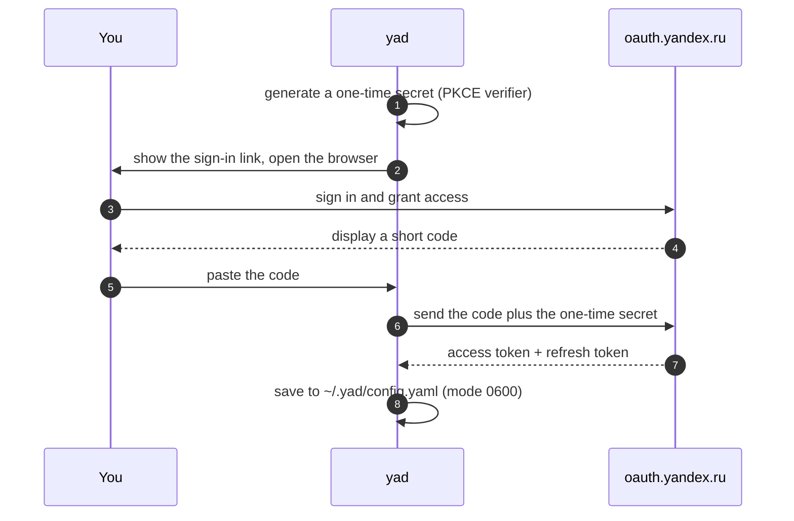

<div align="center">

# 📁 YaD

**Your Yandex.Disk, right in the terminal.**
Browse, upload, download, share and restore files without opening a browser.

[](https://github.com/ilyabrin/yad/actions/workflows/ci.yml)
[](https://github.com/ilyabrin/yad/releases/latest)
[](https://pkg.go.dev/github.com/ilyabrin/yad)
[](https://go.dev)
[](#-licence)

[Install](#-install) · [First run](#-first-run) · [Keys](#️-keys) · [Settings](#️-settings) · [Privacy](#-privacy-and-safety) · [Русская версия](README.ru.md)

</div>

---

## 👋 Is this for you?

If you keep files on [Yandex.Disk](https://disk.yandex.ru) and you would rather
not click through a web page to move them around, yes.

YaD is a small program that runs inside your terminal window and shows your
Disk as a list you can walk through with the arrow keys. You do not need to
know Go, and you do not need to be a programmer. You need a Yandex account and
a terminal.

Everything happens over your own account. YaD talks to Yandex directly, and
nothing passes through anyone else's server.

---

## ✨ What you can do

|                      |                                                                        |
| -------------------- | ---------------------------------------------------------------------- |
| 🗂️ **Browse**        | Walk through folders, search the current page with `/`, sort six ways  |
| ⬆️ **Upload**        | Send a file from your computer, or hand Yandex a link and let it fetch |
| ⬇️ **Download**      | One file, or everything you ticked, queued for you automatically       |
| ✂️ **Organise**      | Make folders, rename, delete, one at a time or in bulk                 |
| 🔗 **Share**         | One key publishes a file, copies its link, or opens it in your browser |
| 🗑️ **Undo mistakes** | Restore things from the bin, or empty it for good                      |
| 📊 **Check space**   | See what is using your storage, with a bar you can read at a glance    |
| 🔐 **Sign in once**  | A short guided sign-in on first launch, then it remembers you          |
| 💾 **Pick up again** | Reopens the folder you were last in, with the sort order you chose     |

<div align="center">

*Shared files are tinted green and marked with `⇡`.*

</div>

---

## 📦 Install

### 1. Pick the file for your computer

Every [release](https://github.com/ilyabrin/yad/releases/latest) has one
archive per system. The part of the name after the version tells you which is
which:

| Your computer                                  | Download the file ending in |
| ---------------------------------------------- | --------------------------- |
| Windows                                        | `windows-amd64.zip`         |
| Mac with an Apple chip (M1, M2, M3, M4 and on) | `darwin-arm64.tar.gz`       |
| Mac with an Intel processor                    | `darwin-amd64.tar.gz`       |
| Linux on a regular PC or server                | `linux-amd64.tar.gz`        |
| Linux on ARM, such as a 64-bit Raspberry Pi    | `linux-arm64.tar.gz`        |

<details>
<summary><b>Not sure which one you have?</b></summary>

- **Mac:** open the Apple menu and choose *About This Mac*. If it lists a
  *Chip* such as Apple M2, take `darwin-arm64`. If it lists an Intel
  *Processor*, take `darwin-amd64`.
- **Linux:** run `uname -m`. `x86_64` means `linux-amd64`, `aarch64` means
  `linux-arm64`.
- **Windows on ARM laptops:** take `windows-amd64` as well. Windows 11 runs it
  through its built-in emulation.

</details>

### 2. Put it where your terminal can find it

<details open>
<summary><b>macOS and Linux</b></summary>

In the folder where you saved the archive:

```sh
tar -xzf yad-*.tar.gz yad
sudo mv yad /usr/local/bin/
yad --version
```

**Rather not use `sudo`?** Put it in your own folder instead. On most Linux
systems `~/.local/bin` is already on your `PATH`:

```sh
mkdir -p ~/.local/bin && mv yad ~/.local/bin/
```

**On macOS**, the system may refuse to start a program downloaded with a
browser, saying it cannot check it for malicious software. Clear that flag
once:

```sh
xattr -d com.apple.quarantine /usr/local/bin/yad
```

</details>

<details>
<summary><b>Windows</b></summary>

In PowerShell, in the folder where you saved the archive:

```powershell
$dest = "$env:LOCALAPPDATA\Programs\yad"
Expand-Archive -Path yad-*-windows-amd64.zip -DestinationPath $dest -Force
[Environment]::SetEnvironmentVariable("Path", [Environment]::GetEnvironmentVariable("Path", "User") + ";$dest", "User")
```

The last line adds the folder to your `PATH`, so run it only once. Then open a
**new** terminal window and check:

```powershell
yad --version
```

Windows Terminal or PowerShell 7 both work well. The classic `cmd.exe` window
will run YaD but renders the colours less prettily.

</details>

<details>
<summary><b>Check the download (optional)</b></summary>

Every release ships a `checksums.txt`. Put it next to the archive and run:

```sh
# Linux
grep linux-amd64 checksums.txt | sha256sum -c

# macOS
grep darwin-arm64 checksums.txt | shasum -a 256 -c
```

```powershell
# Windows: prints True when the file is intact
$expected = (Select-String -Path checksums.txt -Pattern "windows-amd64").Line.Split()[0]
(Get-FileHash (Get-Item yad-*-windows-amd64.zip)).Hash -eq $expected
```

Change the system name in the command to match the archive you downloaded.

</details>

### Or build it yourself

If you already have [Go](https://go.dev) 1.25 or newer:

```sh
go install github.com/ilyabrin/yad@latest
```

Or from a clone:

```sh
git clone https://github.com/ilyabrin/yad
cd yad
go build -o yad .
```

Signing in works exactly the same in a copy you built yourself as in a release
download. There is nothing extra to configure.

### What you need

- Linux, macOS or Windows, and a terminal that can show 256 colours.
- Go, only if you build it yourself.

---

## 🚀 First run

```sh
yad
```

YaD opens your Disk straight away, unless it does not know who you are yet.
On the very first launch it walks you through signing in:

1. It shows you a link and tries to open your browser for you.
2. You sign in to Yandex and allow YaD to reach your Disk.
3. Yandex shows a short code on the page.
4. You paste that code back into the terminal.

That is the whole thing, and it happens once. YaD saves the result in
`~/.yad/config.yaml` and signs you in by itself from then on. When the access
eventually expires, it renews quietly in the background without asking again.

> [!TIP]
> Already have a Yandex token and want to skip the sign-in entirely?
>
> ```sh
> YANDEX_DISK_TOKEN=y0_AgAA... yad
> ```
>
> Handy for scripts, automation, or a one-off session on someone else's machine.

There are two other things YaD can tell you:

```console
yad --help       # the keys, and where settings live
yad --version    # which version you have
```

<details>
<summary><b>What happens under the hood</b></summary>



The one-time secret is created fresh for each sign-in and never leaves your
machine. It is what lets YaD prove the code is really its own, without having
to carry a permanent password around. See [Privacy and safety](#-privacy-and-safety).

If you close YaD midway through signing in, just start again from the link.
The half-finished attempt is simply forgotten.

</details>

---

## ⌨️ Keys

Nothing to memorise up front: run `yad --help` whenever you forget. Arrow keys
work everywhere, and the `hjkl` alternatives are there for people who like them.

### Browsing your files

<table>
<tr><th colspan="2">Moving around</th><th colspan="2">Doing things</th></tr>
<tr>
<td><kbd>↑</kbd> <kbd>k</kbd></td><td>move up</td>
<td><kbd>u</kbd></td><td>upload a file from this computer</td>
</tr>
<tr>
<td><kbd>↓</kbd> <kbd>j</kbd></td><td>move down</td>
<td><kbd>U</kbd></td><td>upload from a link</td>
</tr>
<tr>
<td><kbd>↵</kbd> <kbd>→</kbd> <kbd>l</kbd></td><td>open folder</td>
<td><kbd>d</kbd></td><td>download (everything ticked, if any)</td>
</tr>
<tr>
<td><kbd>←</kbd> <kbd>h</kbd> <kbd>⌫</kbd></td><td>go up one folder</td>
<td><kbd>n</kbd></td><td>new folder</td>
</tr>
<tr>
<td><kbd>/</kbd></td><td>search by name as you type</td>
<td><kbd>r</kbd></td><td>rename</td>
</tr>
<tr>
<td><kbd>s</kbd></td><td>change sort order</td>
<td><kbd>D</kbd></td><td>delete (everything ticked, if any)</td>
</tr>
<tr>
<td><kbd>Space</kbd></td><td>tick or untick this item</td>
<td><kbd>p</kbd></td><td>share, or show the existing link</td>
</tr>
<tr>
<td><kbd>Ctrl</kbd>+<kbd>A</kbd></td><td>tick or untick everything visible</td>
<td><kbd>c</kbd></td><td>copy the share link</td>
</tr>
<tr>
<td><kbd>Esc</kbd></td><td>clear the search, then the ticks</td>
<td><kbd>o</kbd></td><td>open the share link in your browser</td>
</tr>
<tr>
<td><kbd>R</kbd> <kbd>Ctrl</kbd>+<kbd>R</kbd></td><td>reload the list</td>
<td><kbd>m</kbd></td><td>details about this file</td>
</tr>
<tr>
<td><kbd>t</kbd></td><td>open the bin</td>
<td><kbd>i</kbd></td><td>how much space you have left</td>
</tr>
<tr>
<td><kbd>q</kbd> <kbd>Ctrl</kbd>+<kbd>C</kbd></td><td>quit</td>
<td colspan="2"></td>
</tr>
</table>

> [!NOTE]
> <kbd>/</kbd> searches the page you are looking at, which holds 100 items.
> Yandex sends the list a page at a time, so clear the search with <kbd>Esc</kbd>
> before moving to another page.

### In the bin · <kbd>t</kbd>

| Key                                                   | What it does        |
| ----------------------------------------------------- | ------------------- |
| <kbd>↑</kbd> <kbd>k</kbd> / <kbd>↓</kbd> <kbd>j</kbd> | move                |
| <kbd>r</kbd>                                          | put this back       |
| <kbd>D</kbd>                                          | delete it for good  |
| <kbd>E</kbd>                                          | empty the whole bin |
| <kbd>R</kbd> <kbd>Ctrl</kbd>+<kbd>R</kbd>             | reload              |
| <kbd>q</kbd> <kbd>←</kbd> <kbd>Esc</kbd>              | back to your files  |

### Space used · <kbd>i</kbd>

| Key                                      | What it does       |
| ---------------------------------------- | ------------------ |
| <kbd>q</kbd> <kbd>←</kbd> <kbd>Esc</kbd> | back to your files |

---

## ⚙️ Settings

YaD keeps its settings in `~/.yad/config.yaml` (on Windows,
`C:\Users\<you>\.yad\config.yaml`). It creates the file for you, so you only
need to open it if you want to change something.

```yaml
# Written when you sign in. You normally never touch these.
access_token: "y0_AgAA..."
refresh_token: "1:abc..."
token_expiry: "2026-06-01T12:00:00Z"

# Optional: how you like things to look.
default_sort: "-modified"
last_path: "disk:/photos"

# Optional: only if you registered your own Yandex application.
oauth:
  client_id: "your_client_id"
```

| Setting        | What it does                                                                              |
| -------------- | ----------------------------------------------------------------------------------------- |
| `default_sort` | Starting sort order: `name`, `modified` or `size`. A leading `-` reverses it              |
| `last_path`    | Folder to reopen on launch, updated when you quit. Set to `""` to always start at the top |
| `oauth.*`      | Only needed if you use your own Yandex application instead of the built-in one            |

| Environment variable | What it does                                                             |
| -------------------- | ------------------------------------------------------------------------ |
| `YANDEX_DISK_TOKEN`  | Uses this token instead of the saved one, and leaves the saved one alone |

> [!IMPORTANT]
> While `YANDEX_DISK_TOKEN` is set, YaD will not renew the token by itself.
> It treats the variable as a deliberate choice and does not overrule it.

<details>
<summary><b>Using your own Yandex application</b></summary>

Most people never need this. It is useful if you want the access to appear
under your own application in your Yandex account, or if your organisation
requires it.

Register an application at [oauth.yandex.ru](https://oauth.yandex.ru) with the
`cloud_api:disk.read` and `cloud_api:disk.write` permissions, then add it to
`~/.yad/config.yaml`:

```yaml
oauth:
  client_id: "your_client_id"
  # Only if your application is a confidential one that requires a secret.
  # YaD does not need one for its own sign-in.
  client_secret: "your_client_secret"
```

This replaces the built-in application entirely.

</details>

---

## 🔒 Privacy and safety

- **Your files stay between you and Yandex.** YaD has no server of its own and
  sends nothing anywhere else.
- **Your credentials are stored for your eyes only.** The settings file is
  written so that only your user account can read it (`0600`), inside a folder
  with the same restriction (`0700`).
- **There is no password hidden in the program.** Signing in uses
  [PKCE](https://datatracker.ietf.org/doc/html/rfc7636), which makes a one-time
  secret for each sign-in that never leaves your machine. Nothing sensitive is
  baked into the downloadable binaries, so there is nothing to extract from them.
- **The application identifier is public on purpose**, just as it is for tools
  like `gh` and `heroku`. On its own it opens nothing.

> [!WARNING]
> `~/.yad/config.yaml` is the key to your Disk. Do not commit it to a
> repository, sync it to shared storage, or include it in a dotfiles collection.
>
> If you think it has leaked, remove YaD's access at
> [yandex.ru/id/security/applications](https://yandex.ru/id/security/applications)
> and delete the file. Signing in again gives you fresh credentials.

Found a security problem? Please read [SECURITY.md](SECURITY.md) instead of
opening a public issue.

---

## 🤔 Something went wrong

**It says the code is wrong, but I copied it correctly.**
If you closed YaD between opening the link and pasting the code, the attempt
was discarded. Open the link again and use the new code.

**Colours look broken, or characters show up as boxes.**
Your terminal needs 256-colour support and a font with common symbols. On
Windows, try Windows Terminal rather than the classic console window.

**I want to start completely fresh.**
Delete `~/.yad/config.yaml` and run `yad` again.

**It cannot find `yad` after I installed it.**
The program is not on your `PATH`. Either move it to a folder that already is
(`/usr/local/bin` on macOS and Linux), or add its folder to `PATH`.

Still stuck? [Open an issue](https://github.com/ilyabrin/yad/issues/new/choose),
and please say which version (`yad --version`) and which system you are on.

---

## 🧑‍💻 For developers

<details>
<summary><b>Getting started with the code</b></summary>

```sh
git clone https://github.com/ilyabrin/yad && cd yad
go test ./...                 # the tests
go test -race -cover ./...    # what CI runs
gofmt -l . && go vet ./...    # what CI checks
go run .                      # try your changes
```

</details>

<details>
<summary><b>How the project is laid out</b></summary>

```text
.
├── yad.go              # entrypoint: flags, client setup, session persistence
├── config.go           # ~/.yad/config.yaml load and save, precedence rules
├── internal/auth/      # Yandex OAuth 2.0 with PKCE
└── tui/
    ├── app.go          # root Bubbletea model, screen routing, token refresh
    ├── setup.go        # first-run sign-in screen
    ├── browser_*.go    # file browser: model, update, view
    ├── trash.go        # the bin
    ├── diskinfo.go     # storage usage
    ├── ops.go          # async API commands (upload, download, share)
    ├── dialog.go       # confirm, input and progress overlays
    ├── text.go         # width-aware, ANSI-safe truncation
    ├── keys.go         # keybinding map
    └── styles.go       # lipgloss palette
```

The browser follows the Elm architecture: **model** holds state, **update**
turns messages into new state plus commands, **view** is a pure function of the
model. API calls always happen inside a `tea.Cmd`, never in `Update`.

</details>

Commits follow [Conventional Commits](https://www.conventionalcommits.org/)
(`feat:`, `fix:`, `docs:`, `ci:`), and the release notes are generated from them.

[CONTRIBUTING.md](CONTRIBUTING.md) has the full guide.

---

## 🧩 Built with

| Library                                                               | Role                              |
| --------------------------------------------------------------------- | --------------------------------- |
| [charmbracelet/bubbletea](https://github.com/charmbracelet/bubbletea) | TUI framework (Elm architecture)  |
| [charmbracelet/bubbles](https://github.com/charmbracelet/bubbles)     | spinner, text input, key bindings |
| [charmbracelet/lipgloss](https://github.com/charmbracelet/lipgloss)   | terminal styling and layout       |
| [ilyabrin/disk](https://github.com/ilyabrin/disk)                     | Yandex.Disk REST API client       |
| [atotto/clipboard](https://github.com/atotto/clipboard)               | cross-platform clipboard access   |

---

## 📄 Licence

Dual-licensed, at your option, under either of:

- **MIT**: [LICENSE-MIT](LICENSE-MIT) · [spdx.org](https://spdx.org/licenses/MIT.html)
- **Apache License 2.0**: [LICENSE-APACHE](LICENSE-APACHE) · [spdx.org](https://spdx.org/licenses/Apache-2.0.html)

`SPDX-License-Identifier: MIT OR Apache-2.0`

Pick whichever suits you: MIT for the shortest possible terms, Apache 2.0 if
you need its explicit patent grant. Unless you say otherwise, anything you
contribute is dual-licensed the same way, with no extra conditions.

---

<div align="center">

Made with ☕ by [@ilyabrin](https://github.com/ilyabrin) · [Report a bug](https://github.com/ilyabrin/yad/issues/new/choose) · [Security policy](SECURITY.md)

</div>
