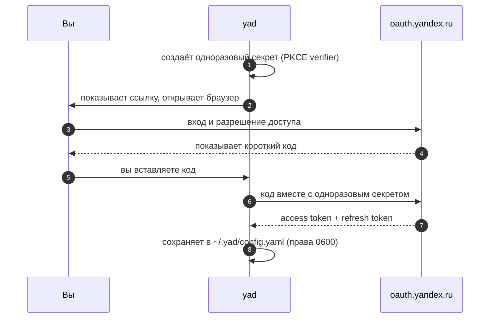

<div align="center">

# 📁 YaD

**Ваш Яндекс.Диск прямо в терминале.**
Смотрите, загружайте, скачивайте, делитесь и восстанавливайте файлы, не открывая браузер.

[](https://github.com/ilyabrin/yad/actions/workflows/ci.yml)
[](https://github.com/ilyabrin/yad/releases/latest)
[](https://pkg.go.dev/github.com/ilyabrin/yad)
[](https://go.dev)
[](#-лицензия)

[Установка](#-установка) · [Первый запуск](#-первый-запуск) · [Клавиши](#️-клавиши) · [Настройки](#️-настройки) · [Приватность](#-приватность-и-безопасность) · [Помощь](#-что-то-пошло-не-так) · [English version](README.md)

</div>

---

## 👋 Это вам подойдёт?

Если вы храните файлы на [Яндекс.Диске](https://disk.yandex.ru) и вам не хочется
кликать по веб-странице, чтобы что-то переложить, то да.

YaD это небольшая программа, которая работает внутри окна терминала и показывает
ваш Диск списком, по которому можно ходить стрелками. Знать Go не нужно, быть
программистом тоже. Нужны аккаунт Яндекса и терминал.

Всё происходит в вашей собственной учётной записи. YaD обращается к Яндексу
напрямую, ничего не проходит через чужие серверы.

---

## ✨ Что можно делать

|                           |                                                                                      |
| ------------------------- | ------------------------------------------------------------------------------------ |
| 🗂️ **Смотреть**           | Ходить по папкам, искать по текущей странице через `/`, сортировать шестью способами |
| ⬆️ **Загружать**          | Отправить файл со своего компьютера или дать Яндексу ссылку, и он скачает сам        |
| ⬇️ **Скачивать**          | Один файл или всё отмеченное, очередь соберётся автоматически                        |
| ✂️ **Наводить порядок**   | Создавать папки, в том числе вложенные, переименовывать и удалять, поштучно и пачкой |
| 🔗 **Делиться**           | Одна клавиша публикует файл, копирует ссылку или открывает её в браузере             |
| 🗑️ **Исправлять ошибки**  | Достать вещи из корзины или очистить её насовсем                                     |
| 📊 **Смотреть место**     | Понять, чем занято хранилище, по наглядной шкале                                     |
| 🔐 **Войти один раз**     | Короткий вход при первом запуске, дальше программа помнит вас                        |
| 💾 **Продолжить с места** | Открывает папку, где вы были, с выбранной сортировкой                                |

<div align="center">

*Файлы с общим доступом подсвечены зелёным и помечены `⇡`.*

</div>

---

## 📦 Установка

### 1. Выберите файл для своего компьютера

В каждом [релизе](https://github.com/ilyabrin/yad/releases/latest) лежит по
архиву на систему. Какой ваш, видно по окончанию имени после номера версии:

| Ваш компьютер                                    | Скачайте файл, который заканчивается на |
| ------------------------------------------------ | --------------------------------------- |
| Windows                                          | `windows-amd64.zip`                     |
| Mac с чипом Apple (M1, M2, M3, M4 и новее)       | `darwin-arm64.tar.gz`                   |
| Mac с процессором Intel                          | `darwin-amd64.tar.gz`                   |
| Linux на обычном ПК или сервере                  | `linux-amd64.tar.gz`                    |
| Linux на ARM, например 64-битный Raspberry Pi    | `linux-arm64.tar.gz`                    |

<details>
<summary><b>Не знаете, какой у вас?</b></summary>

- **Mac:** откройте меню Apple и выберите «Об этом Mac». Если там указан
  *Чип*, например Apple M2, берите `darwin-arm64`. Если указан *Процессор*
  Intel, берите `darwin-amd64`.
- **Linux:** выполните `uname -m`. `x86_64` означает `linux-amd64`, `aarch64`
  означает `linux-arm64`.
- **Ноутбуки на Windows с ARM:** тоже берите `windows-amd64`. Windows 11
  запускает его через встроенную эмуляцию.

</details>

### 2. Положите его туда, где терминал его найдёт

<details open>
<summary><b>macOS и Linux</b></summary>

В папке, куда вы сохранили архив:

```sh
tar -xzf yad-*.tar.gz yad
sudo mv yad /usr/local/bin/
yad --version
```

**Не хотите `sudo`?** Положите программу в свою папку. В большинстве
дистрибутивов Linux `~/.local/bin` уже есть в `PATH`:

```sh
mkdir -p ~/.local/bin && mv yad ~/.local/bin/
```

**В macOS** система может отказаться запускать программу, скачанную через
браузер, с сообщением, что не может проверить её на вредоносность. Снимите эту
отметку один раз:

```sh
xattr -d com.apple.quarantine /usr/local/bin/yad
```

</details>

<details>
<summary><b>Windows</b></summary>

В PowerShell, в папке, куда вы сохранили архив:

```powershell
$dest = "$env:LOCALAPPDATA\Programs\yad"
Expand-Archive -Path yad-*-windows-amd64.zip -DestinationPath $dest -Force
[Environment]::SetEnvironmentVariable("Path", [Environment]::GetEnvironmentVariable("Path", "User") + ";$dest", "User")
```

Последняя строка добавляет папку в `PATH`, поэтому выполните её один раз. Затем
откройте **новое** окно терминала и проверьте:

```powershell
yad --version
```

Windows Terminal и PowerShell 7 подходят одинаково хорошо. Классическое окно
`cmd.exe` тоже запустит YaD, но цвета будут выглядеть хуже.

</details>

<details>
<summary><b>Проверить скачанное (по желанию)</b></summary>

В каждом релизе лежит `checksums.txt`. Положите его рядом с архивом и
выполните:

```sh
# Linux
grep linux-amd64 checksums.txt | sha256sum -c

# macOS
grep darwin-arm64 checksums.txt | shasum -a 256 -c
```

```powershell
# Windows: выведет True, если файл цел
$expected = (Select-String -Path checksums.txt -Pattern "windows-amd64").Line.Split()[0]
(Get-FileHash (Get-Item yad-*-windows-amd64.zip)).Hash -eq $expected
```

Поменяйте название системы в команде на то, что у скачанного вами архива.

</details>

### Или соберите сами

Если у вас уже установлен [Go](https://go.dev) 1.25 или новее:

```sh
go install github.com/ilyabrin/yad@latest
```

Или из клона репозитория:

```sh
git clone https://github.com/ilyabrin/yad
cd yad
go build -o yad .
```

Вход работает совершенно одинаково в собственной сборке и в скачанном релизе.
Ничего дополнительно настраивать не нужно.

### Что понадобится

- Linux, macOS или Windows и терминал, умеющий в 256 цветов.
- Go, только если вы собираете программу сами.

> [!NOTE]
> **В Linux** для копирования ссылки нужна утилита буфера обмена, а во многих
> системах её нет. Установите `xclip` или `xsel` для X11 либо `wl-clipboard` для
> Wayland, например `sudo apt install xclip`. Всё остальное работает и без неё.

---

## 🚀 Первый запуск

```sh
yad
```

YaD сразу открывает ваш Диск, если уже знает, кто вы. При самом первом запуске
он проводит вас через вход:

1. Показывает ссылку и пытается открыть браузер за вас.
2. Вы входите в Яндекс и разрешаете YaD доступ к Диску.
3. Яндекс показывает на странице короткий код.
4. Вы вставляете этот код обратно в терминал.

Вот и всё, и происходит это один раз. YaD сохраняет результат в
`~/.yad/config.yaml` и дальше входит сам. Когда доступ со временем истечёт,
программа тихо обновит его в фоне, ничего не спрашивая.

> [!TIP]
> **На этой машине нет браузера?** Не страшно, например при работе по SSH. YaD
> показывает ссылку на экране, её можно открыть на телефоне или ноутбуке, а код
> вставить сюда.

> [!TIP]
> Уже есть токен Яндекса и хочется пропустить вход целиком?
>
> ```sh
> YANDEX_DISK_TOKEN=y0_AgAA... yad
> ```
>
> Удобно для скриптов, автоматизации или разового сеанса на чужой машине.

YaD умеет рассказать о себе ещё две вещи:

```console
yad --help       # клавиши и где лежат настройки
yad --version    # какая у вас версия
```

<details>
<summary><b>Что происходит под капотом</b></summary>



Одноразовый секрет создаётся заново для каждого входа и никогда не покидает вашу
машину. Именно он позволяет YaD доказать, что код принадлежит ему, не таская с
собой постоянный пароль. Подробнее в разделе [Приватность и безопасность](#-приватность-и-безопасность).

Если закрыть YaD посреди входа, просто начните заново со ссылки. Незавершённая
попытка просто забывается.

</details>

---

## ⌨️ Клавиши

Запоминать заранее ничего не нужно. Нижняя строка экрана всегда показывает
основные клавиши, а `yad --help` выводит все. Стрелки работают везде, а
альтернативы `hjkl` есть для тех, кто к ним привык.

### Просмотр файлов

<table>
<tr><th colspan="2">Перемещение</th><th colspan="2">Действия</th></tr>
<tr>
<td><kbd>↑</kbd> <kbd>k</kbd></td><td>вверх</td>
<td><kbd>u</kbd></td><td>загрузить файл с этого компьютера</td>
</tr>
<tr>
<td><kbd>↓</kbd> <kbd>j</kbd></td><td>вниз</td>
<td><kbd>U</kbd></td><td>загрузить по ссылке</td>
</tr>
<tr>
<td><kbd>↵</kbd> <kbd>→</kbd> <kbd>l</kbd></td><td>открыть папку</td>
<td><kbd>d</kbd></td><td>скачать (всё отмеченное, если есть)</td>
</tr>
<tr>
<td><kbd>←</kbd> <kbd>h</kbd> <kbd>⌫</kbd></td><td>на папку выше</td>
<td><kbd>n</kbd></td><td>новая папка или путь вроде <code>a/b/c</code></td>
</tr>
<tr>
<td><kbd>/</kbd></td><td>поиск по имени по мере ввода</td>
<td><kbd>r</kbd></td><td>переименовать</td>
</tr>
<tr>
<td><kbd>s</kbd></td><td>сменить сортировку</td>
<td><kbd>D</kbd></td><td>удалить (всё отмеченное, если есть)</td>
</tr>
<tr>
<td><kbd>Space</kbd></td><td>отметить или снять отметку</td>
<td><kbd>p</kbd></td><td>поделиться или показать готовую ссылку</td>
</tr>
<tr>
<td><kbd>Ctrl</kbd>+<kbd>A</kbd></td><td>отметить или снять всё видимое</td>
<td><kbd>c</kbd></td><td>скопировать ссылку</td>
</tr>
<tr>
<td><kbd>Esc</kbd></td><td>сбросить поиск, затем отметки</td>
<td><kbd>o</kbd></td><td>открыть ссылку в браузере</td>
</tr>
<tr>
<td><kbd>R</kbd> <kbd>Ctrl</kbd>+<kbd>R</kbd></td><td>обновить список</td>
<td><kbd>m</kbd></td><td>подробности о файле</td>
</tr>
<tr>
<td><kbd>t</kbd></td><td>открыть корзину</td>
<td><kbd>i</kbd></td><td>сколько места осталось</td>
</tr>
<tr>
<td><kbd>q</kbd> <kbd>Ctrl</kbd>+<kbd>C</kbd></td><td>выход</td>
<td colspan="2"></td>
</tr>
</table>

> [!NOTE]
> <kbd>/</kbd> ищет по той странице, которую вы видите, а в ней 100 элементов.
> Яндекс отдаёт список постранично, поэтому перед переходом на другую страницу
> сбросьте поиск клавишей <kbd>Esc</kbd>.

### В корзине · <kbd>t</kbd>

| Клавиша                                               | Что делает       |
| ----------------------------------------------------- | ---------------- |
| <kbd>↑</kbd> <kbd>k</kbd> / <kbd>↓</kbd> <kbd>j</kbd> | перемещение      |
| <kbd>r</kbd>                                          | вернуть на место |
| <kbd>D</kbd>                                          | удалить насовсем |
| <kbd>E</kbd>                                          | очистить корзину |
| <kbd>R</kbd> <kbd>Ctrl</kbd>+<kbd>R</kbd>             | обновить         |
| <kbd>q</kbd> <kbd>←</kbd> <kbd>Esc</kbd>              | назад к файлам   |

### Занятое место · <kbd>i</kbd>

| Клавиша                                  | Что делает     |
| ---------------------------------------- | -------------- |
| <kbd>q</kbd> <kbd>←</kbd> <kbd>Esc</kbd> | назад к файлам |

---

## ⚙️ Настройки

YaD хранит настройки в `~/.yad/config.yaml` (в Windows это
`C:\Users\<вы>\.yad\config.yaml`). Файл создаётся сам, открывать его нужно,
только если вы хотите что-то поменять.

```yaml
# Записывается при входе. Обычно это трогать не нужно.
access_token: "y0_AgAA..."
refresh_token: "1:abc..."
token_expiry: "2026-06-01T12:00:00Z"

# По желанию: как вам удобнее.
default_sort: "-modified"
last_path: "disk:/photos"

# По желанию: только если вы зарегистрировали своё приложение в Яндексе.
oauth:
  client_id: "ваш_client_id"
```

| Настройка      | Что делает                                                                           |
| -------------- | ------------------------------------------------------------------------------------ |
| `default_sort` | Сортировка при старте: `name`, `modified` или `size`. Минус впереди разворачивает    |
| `last_path`    | Папка, открываемая при запуске, обновляется при выходе. `""`: всегда начинать сверху |
| `oauth.*`      | Нужно, только если вы используете своё приложение вместо встроенного                 |

| Переменная окружения | Что делает                                                        |
| -------------------- | ----------------------------------------------------------------- |
| `YANDEX_DISK_TOKEN`  | Использует этот токен вместо сохранённого, сохранённый не трогает |

> [!IMPORTANT]
> Пока задана `YANDEX_DISK_TOKEN`, YaD не будет обновлять токен сам. Программа
> считает переменную осознанным решением и не переопределяет его.

<details>
<summary><b>Своё приложение в Яндексе</b></summary>

Большинству это никогда не понадобится. Пригодится, если хочется, чтобы доступ
отображался под вашим собственным приложением в аккаунте Яндекса, или если
этого требует ваша организация.

Зарегистрируйте приложение на [oauth.yandex.ru](https://oauth.yandex.ru) с
правами `cloud_api:disk.read` и `cloud_api:disk.write`, затем добавьте его в
`~/.yad/config.yaml`:

```yaml
oauth:
  client_id: "ваш_client_id"
  # Только если ваше приложение конфиденциальное и требует секрет.
  # Собственному входу YaD секрет не нужен.
  client_secret: "ваш_client_secret"
```

Это полностью заменяет встроенное приложение.

</details>

---

## 🔒 Приватность и безопасность

- **Ваши файлы остаются между вами и Яндексом.** У YaD нет своего сервера, и
  программа никуда больше ничего не отправляет.
- **Учётные данные хранятся только для вас.** Файл настроек записывается так,
  что прочитать его может только ваша учётная запись (`0600`), внутри папки с
  тем же ограничением (`0700`).
- **В программе не спрятан пароль.** Вход использует
  [PKCE](https://datatracker.ietf.org/doc/html/rfc7636): для каждого входа
  создаётся одноразовый секрет, который не покидает вашу машину. В скачиваемых
  бинарниках нет ничего чувствительного, поэтому и извлекать из них нечего.
- **Идентификатор приложения публичен намеренно**, ровно как у инструментов
  вроде `gh` и `heroku`. Сам по себе он ничего не открывает.

> [!WARNING]
> Файл `~/.yad/config.yaml` это ключ от вашего Диска. Не коммитьте его в
> репозиторий, не синхронизируйте в общее хранилище и не кладите в коллекцию
> дотфайлов.
>
> Если подозреваете утечку, отзовите доступ YaD на странице
> [yandex.ru/id/security/applications](https://yandex.ru/id/security/applications)
> и удалите файл. Повторный вход выдаст новые учётные данные.

Нашли проблему с безопасностью? Прочитайте [SECURITY.md](SECURITY.md), не
открывайте публичную задачу.

---

## 🤔 Что-то пошло не так

<details>
<summary><b>Терминал пишет, что не находит <code>yad</code></b></summary>

Программы нет в `PATH`. В macOS и Linux проверьте, что вы переложили её в
`/usr/local/bin` или `~/.local/bin`. В Windows убедитесь, что выполнили строку с
`PATH` из шагов установки, и откройте **новое** окно терминала: уже открытое
изменения не увидит.

</details>

<details>
<summary><b>macOS пишет, что не может проверить yad на вредоносность</b></summary>

Браузер пометил файл как скачанный из интернета. Снимите отметку один раз:

```sh
xattr -d com.apple.quarantine /usr/local/bin/yad
```

</details>

<details>
<summary><b>В Linux не копируется ссылка</b></summary>

YaD передаёт ссылку утилите буфера обмена, а её нет. Установите `xclip` или
`xsel` для X11 либо `wl-clipboard` для Wayland. Прочитать ссылку на экране можно
и так, клавишей <kbd>p</kbd>.

</details>

<details>
<summary><b>Пишет, что код входа неверный, хотя я скопировал правильно</b></summary>

Если вы закрыли YaD между открытием ссылки и вставкой кода, эта попытка
отброшена. Откройте ссылку заново и возьмите новый код.

</details>

<details>
<summary><b>Цвета выглядят сломанными или вместо символов квадратики</b></summary>

Терминалу нужна поддержка 256 цветов и шрифт с распространёнными символами. В
Windows попробуйте Windows Terminal вместо классического окна консоли.

</details>

<details>
<summary><b>Хочу начать с чистого листа</b></summary>

Удалите `~/.yad/config.yaml` и запустите `yad` снова. Программа попросит
войти заново.

</details>

Не помогло? [Спросите в Discussions](https://github.com/ilyabrin/yad/discussions)
или [откройте задачу](https://github.com/ilyabrin/yad/issues/new/choose) и
укажите версию (`yad --version`) и вашу систему.

---

## 🧑‍💻 Для разработчиков

<details>
<summary><b>С чего начать</b></summary>

```sh
git clone https://github.com/ilyabrin/yad && cd yad
go test ./...                 # тесты
go test -race -cover ./...    # то, что гоняет CI
gofmt -l . && go vet ./...    # то, что проверяет CI
go run .                      # попробовать свои правки
```

</details>

<details>
<summary><b>Как устроен проект</b></summary>

```text
.
├── yad.go              # точка входа: флаги, создание клиента, сохранение сессии
├── config.go           # чтение и запись ~/.yad/config.yaml, приоритеты
├── internal/auth/      # Yandex OAuth 2.0 с PKCE
└── tui/
    ├── app.go          # корневая модель Bubbletea, маршрутизация экранов
    ├── setup.go        # экран входа при первом запуске
    ├── browser_*.go    # файловый браузер: модель, обновление, отрисовка
    ├── trash.go        # корзина
    ├── diskinfo.go     # занятое место
    ├── ops.go          # асинхронные команды к API (загрузка, скачивание)
    ├── dialog.go       # подтверждения, ввод, прогресс
    ├── text.go         # обрезка текста с учётом ширины и ANSI
    ├── keys.go         # карта клавиш
    └── styles.go       # палитра lipgloss
```

Браузер следует архитектуре Elm: **модель** хранит состояние, **update**
превращает сообщения в новое состояние и команды, **view** это чистая функция
от модели. Обращения к API всегда происходят внутри `tea.Cmd`, никогда в
`Update`.

</details>

Коммиты следуют [Conventional Commits](https://www.conventionalcommits.org/)
(`feat:`, `fix:`, `docs:`, `ci:`), из них собираются заметки к релизу.

Полное руководство в [CONTRIBUTING.md](CONTRIBUTING.md).

---

## 🧩 На чём построено

| Библиотека                                                            | Роль                             |
| --------------------------------------------------------------------- | -------------------------------- |
| [charmbracelet/bubbletea](https://github.com/charmbracelet/bubbletea) | TUI-фреймворк (архитектура Elm)  |
| [charmbracelet/bubbles](https://github.com/charmbracelet/bubbles)     | спиннер, поле ввода, клавиши     |
| [charmbracelet/lipgloss](https://github.com/charmbracelet/lipgloss)   | стилизация и вёрстка в терминале |
| [ilyabrin/disk](https://github.com/ilyabrin/disk)                     | клиент REST API Яндекс.Диска     |
| [atotto/clipboard](https://github.com/atotto/clipboard)               | буфер обмена на всех платформах  |

---

## 📄 Лицензия

Двойная лицензия, на ваш выбор:

- **MIT**: [LICENSE-MIT](LICENSE-MIT) · [spdx.org](https://spdx.org/licenses/MIT.html)
- **Apache License 2.0**: [LICENSE-APACHE](LICENSE-APACHE) · [spdx.org](https://spdx.org/licenses/Apache-2.0.html)

`SPDX-License-Identifier: MIT OR Apache-2.0`

Выбирайте, что удобнее: MIT ради максимально коротких условий, Apache 2.0 ради
явной патентной оговорки. Если вы не укажете иное, ваш вклад распространяется
на тех же условиях, без дополнительных оговорок.

---

<div align="center">

Сделано с ☕ [@ilyabrin](https://github.com/ilyabrin) · [Сообщить об ошибке](https://github.com/ilyabrin/yad/issues/new/choose) · [Политика безопасности](SECURITY.md)

</div>
