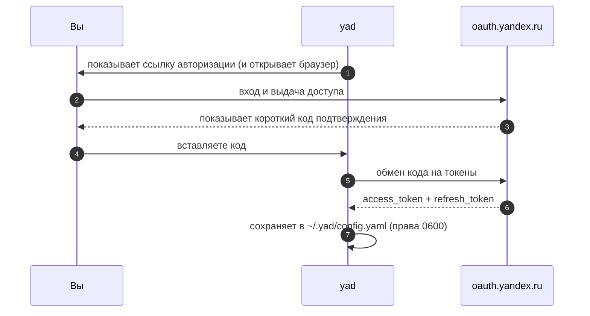

<div align="center">

# 📁 YaD — Яндекс.Диск в терминале

**Быстрый TUI для [Яндекс.Диска](https://disk.yandex.ru), управляемый с клавиатуры.**
Просматривайте, загружайте, публикуйте и восстанавливайте файлы, не выходя из консоли.

[](https://github.com/ilyabrin/yad/actions/workflows/ci.yml)
[](https://github.com/ilyabrin/yad/releases/latest)
[](https://pkg.go.dev/github.com/ilyabrin/yad)
[](https://go.dev)
[](#-лицензия)

[Быстрый старт](#-быстрый-старт) · [Клавиши](#%EF%B8%8F-клавиши) · [Конфигурация](#%EF%B8%8F-конфигурация) · [Аутентификация](#-аутентификация) · [Разработка](#-разработка) · [English version](README.md)

</div>

---

## ✨ Возможности

|                     | |
| ------------------- | --------------------------------------------------------------------------- |
| 🗂 **Просмотр**      | Полноэкранный файловый браузер: пагинация, живой фильтр `/`, 6 режимов сортировки |
| ⬆️ **Загрузка**      | Локальные файлы **или** удалённые URL с прогресс-баром в реальном времени    |
| ⬇️ **Скачивание**    | Один файл или все выделенные — очередь формируется автоматически             |
| ✂️ **Управление**    | Создание папок, переименование, удаление — поштучно и массово                |
| 🔗 **Публикация**    | Одна клавиша: опубликовать, скопировать ссылку, открыть в браузере           |
| 🗑 **Корзина**       | Восстановление, удаление навсегда, полная очистка                            |
| 📊 **Информация**    | Разбивка занятого места с наглядной шкалой                                   |
| 🔐 **OAuth 2.0**     | Мастер настройки при первом запуске, токены с правами `0600`, тихое обновление |
| 💾 **Память сессии** | Сортировка и последняя открытая папка восстанавливаются при следующем запуске |

<div align="center">

*Опубликованные файлы подсвечены зелёным и помечены `⇡`.*

</div>

---

## 🚀 Быстрый старт

```sh
go install github.com/ilyabrin/yad@latest
yad
```

Всё — при первом запуске `yad` проведёт вас через аутентификацию и сохранит результат в `~/.yad/config.yaml`.

```console
$ yad              # открыть файловый браузер
$ yad --help       # показать клавиши и пути конфигурации
$ yad --version    # показать версию
```

> [!TIP]
> Токен уже есть? Мастер можно пропустить целиком:
> ```sh
> YANDEX_DISK_TOKEN=y0_AgAA... yad
> ```

---

## 📦 Установка

<details open>
<summary><b>go install</b> — самый быстрый способ</summary>

```sh
go install github.com/ilyabrin/yad@latest
```

> [!NOTE]
> В такой сборке **нет встроенного OAuth client secret**, поэтому мастер попросит вставить токен вручную вместо автоматического обмена кода. Подробнее — в разделе [Аутентификация](#-аутентификация).

</details>

<details>
<summary><b>Готовые бинарники</b> — рекомендуется</summary>

Скачайте архив для своей платформы из [последнего релиза](https://github.com/ilyabrin/yad/releases/latest) и положите `yad` в `PATH`:

```sh
tar -xzf yad-<version>-<os>-<arch>.tar.gz
sudo mv yad /usr/local/bin/
yad --version
```

Контрольные суммы публикуются рядом с архивами в `checksums.txt`.

</details>

<details>
<summary><b>Сборка из исходников</b></summary>

```sh
git clone https://github.com/ilyabrin/yad
cd yad
go build -o yad .
```

Вход работает одинаково в собственной сборке и в скачанном релизе:
YaD использует PKCE, и client secret ему не нужен.

</details>

**Требования:** Go 1.25+ (только для сборки) · Linux, macOS или Windows · любой 256-цветный терминал.

---

## ⌨️ Клавиши

### Файловый браузер

<table>
<tr><th colspan="2">Навигация</th><th colspan="2">Действия</th></tr>
<tr>
<td><kbd>↑</kbd> <kbd>k</kbd></td><td>вверх</td>
<td><kbd>u</kbd></td><td>загрузить локальный файл</td>
</tr>
<tr>
<td><kbd>↓</kbd> <kbd>j</kbd></td><td>вниз</td>
<td><kbd>U</kbd></td><td>загрузить по URL</td>
</tr>
<tr>
<td><kbd>↵</kbd> <kbd>→</kbd> <kbd>l</kbd></td><td>открыть папку</td>
<td><kbd>d</kbd></td><td>скачать (массово, если выделено)</td>
</tr>
<tr>
<td><kbd>←</kbd> <kbd>h</kbd> <kbd>⌫</kbd></td><td>на уровень выше</td>
<td><kbd>n</kbd></td><td>новая папка</td>
</tr>
<tr>
<td><kbd>/</kbd></td><td>фильтр по имени (живой)</td>
<td><kbd>r</kbd></td><td>переименовать</td>
</tr>
<tr>
<td><kbd>s</kbd></td><td>сменить сортировку</td>
<td><kbd>D</kbd></td><td>удалить (массово, если выделено)</td>
</tr>
<tr>
<td><kbd>Space</kbd></td><td>выделить / снять выделение</td>
<td><kbd>p</kbd></td><td>опубликовать / показать ссылку</td>
</tr>
<tr>
<td><kbd>Ctrl</kbd>+<kbd>A</kbd></td><td>выделить / снять всё видимое</td>
<td><kbd>c</kbd></td><td>скопировать публичную ссылку</td>
</tr>
<tr>
<td><kbd>Esc</kbd></td><td>сбросить фильтр, затем выделение</td>
<td><kbd>o</kbd></td><td>открыть ссылку в браузере</td>
</tr>
<tr>
<td><kbd>R</kbd> <kbd>Ctrl</kbd>+<kbd>R</kbd></td><td>обновить список</td>
<td><kbd>m</kbd></td><td>метаданные файла</td>
</tr>
<tr>
<td><kbd>t</kbd></td><td>корзина</td>
<td><kbd>i</kbd></td><td>информация о диске</td>
</tr>
<tr>
<td><kbd>q</kbd> <kbd>Ctrl</kbd>+<kbd>C</kbd></td><td>выход</td>
<td colspan="2"></td>
</tr>
</table>

> [!NOTE]
> <kbd>/</kbd> фильтрует **текущую страницу** (100 элементов). Пагинация серверная, поэтому перед переходом на другую страницу через <kbd>↑</kbd>/<kbd>↓</kbd> сбросьте фильтр клавишей <kbd>Esc</kbd>.

### Корзина · <kbd>t</kbd>

| Клавиша                                                | Действие              |
| ------------------------------------------------------ | --------------------- |
| <kbd>↑</kbd> <kbd>k</kbd> / <kbd>↓</kbd> <kbd>j</kbd>  | перемещение           |
| <kbd>r</kbd>                                           | восстановить          |
| <kbd>D</kbd>                                           | удалить навсегда      |
| <kbd>E</kbd>                                           | очистить корзину      |
| <kbd>R</kbd> <kbd>Ctrl</kbd>+<kbd>R</kbd>              | обновить              |
| <kbd>q</kbd> <kbd>←</kbd> <kbd>Esc</kbd>               | назад в браузер       |

### Информация о диске · <kbd>i</kbd>

| Клавиша                                  | Действие        |
| ---------------------------------------- | --------------- |
| <kbd>q</kbd> <kbd>←</kbd> <kbd>Esc</kbd> | назад в браузер |

---

## 🔐 Аутентификация

При первом запуске `yad` показывает короткий мастер:



Дальше токены подхватываются автоматически. Когда access-токен истекает, `yad` тихо обновляет его в фоне — мастер больше не появится.

### Источники токена по приоритету

| # | Источник                        | Когда использовать                        |
| - | ------------------------------- | ----------------------------------------- |
| 1 | Переменная `YANDEX_DISK_TOKEN`  | CI, скрипты, одноразовые сессии            |
| 2 | `access_token` в конфиге        | обычная работа (записывается мастером)     |

> [!IMPORTANT]
> Если задана `YANDEX_DISK_TOKEN`, автообновление отключается: переменная считается явным переопределением, которое `yad` не имеет права заменять.

<details>
<summary><b>Своё приложение Яндекса</b></summary>

Зарегистрируйте приложение на [oauth.yandex.ru](https://oauth.yandex.ru) с правами `cloud_api:disk.read` и `cloud_api:disk.write`, затем добавьте учётные данные в `~/.yad/config.yaml`:

```yaml
oauth:
  client_id: "ваш_client_id"
  client_secret: "ваш_client_secret"
```

Эти значения полностью переопределяют встроенные в сборку.

</details>

---

## ⚙️ Конфигурация

Файл `~/.yad/config.yaml` создаётся автоматически с правами `0600`.

```yaml
# ── Записывается мастером OAuth — руками обычно не трогают ──
access_token: "y0_AgAA..."
refresh_token: "1:abc..."
token_expiry: "2026-06-01T12:00:00Z"

# ── Опционально: своё зарегистрированное приложение ──
oauth:
  client_id: "ваш_client_id"
  client_secret: "ваш_client_secret"

# ── Опционально: настройки интерфейса ──
default_sort: "-modified"
last_path: "disk:/photos"
```

| Ключ            | Тип    | По умолчанию | Описание                                                                          |
| --------------- | ------ | ------------ | --------------------------------------------------------------------------------- |
| `default_sort`  | строка | `name`       | Одно из `name`, `-name`, `modified`, `-modified`, `size`, `-size` (`-` — по убыванию) |
| `last_path`     | строка | `/`          | Папка, открываемая при старте; обновляется при выходе. `""` — всегда открывать корень |
| `oauth.*`       | строка | —            | Переопределяет встроенное OAuth-приложение                                        |

| Переменная окружения | Эффект                                                          |
| -------------------- | --------------------------------------------------------------- |
| `YANDEX_DISK_TOKEN`  | Переопределяет сохранённый токен и отключает автообновление      |

---

## 🔒 Безопасность

- Конфиг пишется с правами `0600`, каталог — `0700`: читать может только владелец.
- Вход использует **PKCE** ([RFC 7636](https://datatracker.ietf.org/doc/html/rfc7636)), поэтому client secret нет нигде: ни в репозитории, ни в собранных бинарниках, ни у вас на диске. Каждый вход порождает одноразовый секрет, который не покидает вашу машину.
- OAuth **client ID публичен по замыслу**, такой же подход у `gh` и `heroku`. Сам по себе он не даёт доступа ни к чему.
- Нужен полный контроль? Зарегистрируйте своё приложение и укажите `oauth.client_id` в `~/.yad/config.yaml`, а также `oauth.client_secret`, если ваше приложение его требует.

> [!WARNING]
> В `~/.yad/config.yaml` лежат рабочие учётные данные. Не коммитьте его, не синхронизируйте и не кладите в репозитории с дотфайлами.

---

## 🧑‍💻 Разработка

```sh
git clone https://github.com/ilyabrin/yad && cd yad
go test ./...                 # юнит-тесты
go test -race -cover ./...    # то, что гоняет CI
gofmt -l . && go vet ./...    # то, что проверяет CI
go run .                      # запустить локально
```

<details>
<summary><b>Структура проекта</b></summary>

```
.
├── yad.go              # точка входа: флаги, создание клиента, сохранение сессии
├── config.go           # чтение/запись ~/.yad/config.yaml и приоритеты источников
├── internal/auth/      # Yandex OAuth 2.0 (авторизация, обмен, обновление)
└── tui/
    ├── app.go          # корневая модель Bubbletea, маршрутизация экранов, refresh токена
    ├── setup.go        # экран мастера OAuth при первом запуске
    ├── browser_*.go    # файловый браузер — model / update / view
    ├── trash.go        # экран корзины
    ├── diskinfo.go     # экран информации о диске
    ├── ops.go          # асинхронные команды API (upload, download, publish…)
    ├── dialog.go       # оверлеи подтверждения / ввода / прогресса
    ├── text.go         # обрезка текста с учётом ширины символов и ANSI
    ├── keys.go         # карта клавиш
    └── styles.go       # палитра lipgloss
```

Браузер построен по архитектуре Elm: **model** хранит состояние, **update** превращает сообщения в новое состояние и команды, **view** — чистая функция от модели. Вызовы API всегда происходят внутри `tea.Cmd`, никогда в `Update`.

</details>

Коммиты следуют [Conventional Commits](https://www.conventionalcommits.org/) (`feat:`, `fix:`, `docs:`, `ci:`…) — changelog релиза генерируется из них.

Полное руководство — в [CONTRIBUTING.md](CONTRIBUTING.md); перед сообщением о проблеме безопасности загляните в [SECURITY.md](SECURITY.md).

---

## 🧩 На чём построено

| Библиотека | Роль |
| ---------- | ---- |
| [charmbracelet/bubbletea](https://github.com/charmbracelet/bubbletea) | TUI-фреймворк (архитектура Elm) |
| [charmbracelet/bubbles](https://github.com/charmbracelet/bubbles)     | спиннер, поля ввода, биндинги клавиш |
| [charmbracelet/lipgloss](https://github.com/charmbracelet/lipgloss)   | стилизация и вёрстка в терминале |
| [ilyabrin/disk](https://github.com/ilyabrin/disk)                     | клиент REST API Яндекс.Диска |
| [atotto/clipboard](https://github.com/atotto/clipboard)               | кроссплатформенный буфер обмена |

---

## 📄 Лицензия

Двойное лицензирование — выбирайте любую из двух на своё усмотрение:

- **MIT** — [LICENSE-MIT](LICENSE-MIT) · [spdx.org](https://spdx.org/licenses/MIT.html)
- **Apache License 2.0** — [LICENSE-APACHE](LICENSE-APACHE) · [spdx.org](https://spdx.org/licenses/Apache-2.0.html)

`SPDX-License-Identifier: MIT OR Apache-2.0`

MIT — если нужны максимально короткие условия, Apache 2.0 — если важен явный патентный грант. Любой ваш вклад, если не оговорено иное, распространяется на тех же двух лицензиях без дополнительных условий.

---

<div align="center">

Сделано с ☕ [@ilyabrin](https://github.com/ilyabrin) · [Сообщить об ошибке](https://github.com/ilyabrin/yad/issues/new/choose) · [Политика безопасности](SECURITY.md)

</div>
